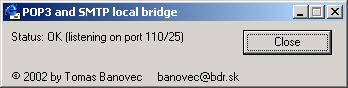



## POP3 and SMTP bridge

### Description

Allows you to use your e-mail client (e.g. Outlook Express)in your LAN network with no direct internet connection. Supported also sending mails via servers that require authentification. Also well commented. Try and vote for me. Thanx
 
### More Info
 

             |
---                |---
**Submitted On**   |2002-07-03 11:38:36
**By**             |[Tomas Banovec](https://github.com/Planet-Source-Code/PSCIndex/blob/master/ByAuthor/tomas-banovec.md)
**Level**          |Advanced
**User Rating**    |4.6 (32 globes from 7 users)
**Compatibility**  |VB 5\.0, VB 6\.0
**Category**       |[Internet/ HTML](https://github.com/Planet-Source-Code/PSCIndex/blob/master/ByCategory/internet-html__1-34.md)
**World**          |[Visual Basic](https://github.com/Planet-Source-Code/PSCIndex/blob/master/ByWorld/visual-basic.md)
**Archive File**   |[POP3\_and\_S102793762002\.zip](https://github.com/Planet-Source-Code/tomas-banovec-pop3-and-smtp-bridge__1-36635/archive/master.zip)

